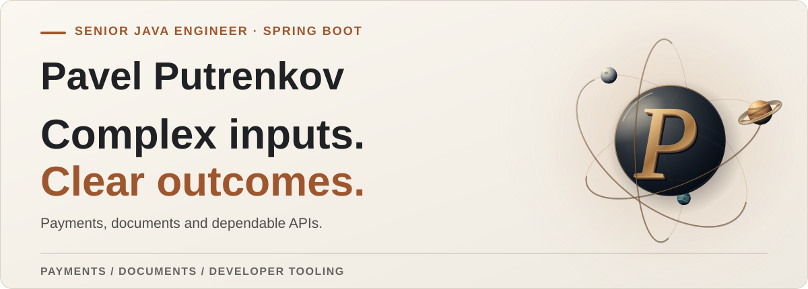

<picture>
  <source media="(prefers-reduced-motion: reduce) and (prefers-color-scheme: dark) and (max-width: 600px)" srcset="./assets/profile-cover-2026-static-mobile-dark.svg">
  <source media="(prefers-reduced-motion: reduce) and (prefers-color-scheme: light) and (max-width: 600px)" srcset="./assets/profile-cover-2026-static-mobile-light.svg">
  <source media="(prefers-reduced-motion: reduce) and (prefers-color-scheme: dark)" srcset="./assets/profile-cover-2026-static-dark.svg">
  <source media="(prefers-reduced-motion: reduce) and (prefers-color-scheme: light)" srcset="./assets/profile-cover-2026-static-light.svg">
  <source media="(prefers-color-scheme: dark) and (max-width: 600px)" srcset="./assets/profile-cover-2026-animated-mobile-dark.svg">
  <source media="(prefers-color-scheme: light) and (max-width: 600px)" srcset="./assets/profile-cover-2026-animated-mobile-light.svg">
  <source media="(prefers-color-scheme: dark)" srcset="./assets/profile-cover-2026-animated-dark.svg">
  <source media="(prefers-color-scheme: light)" srcset="./assets/profile-cover-2026-animated-light.svg">
  
</picture>

Hi, I'm Pavel. I care about the details that decide whether software is actually
useful: whether a PDF can be searched, whether records from two databases can
be served through one clear API, and whether a failure points to its cause. I
build Java and Spring systems around those details.

[**Explore my PDF tool**](https://github.com/lMysticl/pdf-text-layer-auditor) · [Connect on LinkedIn](https://www.linkedin.com/in/pavlo-putrenkov/)

## Featured projects

### 01 · [PDF Text Layer Auditor](https://github.com/lMysticl/pdf-text-layer-auditor)

A PDF can look perfect while its text layer is missing. I built a Java 21 CLI
and GitHub Action that flags suspicious pages before they disrupt search,
extraction, or accessibility workflows. Its JSON output is versioned for
automation.

[Source code](https://github.com/lMysticl/pdf-text-layer-auditor) · [GitHub Marketplace](https://github.com/marketplace/actions/pdf-text-layer-audit) · [Latest release](https://github.com/lMysticl/pdf-text-layer-auditor/releases/latest)

### 02 · [User Aggregation Service](https://github.com/lMysticl/user-aggregation-service)

An API consumer should not have to know which database holds a user record.
This Java 21 and Spring Boot service brings PostgreSQL and MongoDB records
behind one validated REST API, with bounded concurrent aggregation, caching,
migrations, and OpenAPI.

[Source code](https://github.com/lMysticl/user-aggregation-service) · [Latest release](https://github.com/lMysticl/user-aggregation-service/releases/latest)

## Engineering approach

I favor explicit contracts, errors that tell you where to look, and tests that
make a change easier to trust. When a project needs a frontend, I work in React
and TypeScript too.

## Open-source history

My earlier Broadleaf Commerce contributions were made through my former work
account, [`putrenkov`](https://github.com/putrenkov):

- [Historical order purge](https://github.com/BroadleafCommerce/BroadleafCommerce/pull/2360) — retention safety and MySQL/PostgreSQL compatibility.
- [Domain equality and serialization invariants](https://github.com/BroadleafCommerce/BroadleafCommerce/pull/2156) — regression coverage across the domain model.
- [Multi-catalog persistence fix](https://github.com/BroadleafCommerce/BroadleafCommerce/pull/2367) — a persistence defect validated through review.
