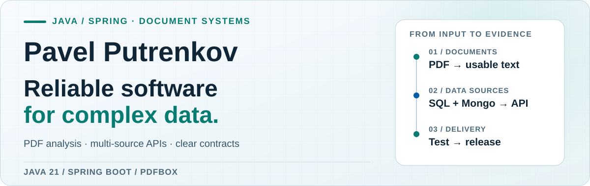

<picture>
  <source media="(prefers-reduced-motion: reduce) and (prefers-color-scheme: dark) and (max-width: 600px)" srcset="./assets/profile-hero-2026-static-mobile-dark.svg">
  <source media="(prefers-reduced-motion: reduce) and (prefers-color-scheme: light) and (max-width: 600px)" srcset="./assets/profile-hero-2026-static-mobile-light.svg">
  <source media="(prefers-reduced-motion: reduce) and (prefers-color-scheme: dark)" srcset="./assets/profile-hero-2026-static-dark.svg">
  <source media="(prefers-reduced-motion: reduce) and (prefers-color-scheme: light)" srcset="./assets/profile-hero-2026-static-light.svg">
  <source media="(prefers-color-scheme: dark) and (max-width: 600px)" srcset="./assets/profile-hero-2026-animated-mobile-dark.svg">
  <source media="(prefers-color-scheme: light) and (max-width: 600px)" srcset="./assets/profile-hero-2026-animated-mobile-light.svg">
  <source media="(prefers-color-scheme: dark)" srcset="./assets/profile-hero-2026-animated-dark.svg">
  <source media="(prefers-color-scheme: light)" srcset="./assets/profile-hero-2026-animated-light.svg">
  
</picture>

Hi, I'm Pavel. I enjoy solving backend problems that hide in plain sight: a
PDF that looks readable but cannot be searched, or user data split across
databases. I build Java and Spring tools that make those problems visible and
easier for other engineers to fix.

[**Explore PDF auditor**](https://github.com/lMysticl/pdf-text-layer-auditor) · [LinkedIn](https://www.linkedin.com/in/pavlo-putrenkov/)

## Selected work

### 01 / [PDF Text Layer Auditor](https://github.com/lMysticl/pdf-text-layer-auditor)

**Detects broken PDF text layers before they disrupt search, copy/paste,
accessibility, or extraction.** A Java 21 CLI and GitHub Action with page-level
diagnostics and versioned JSON output.

`Java 21` · `PDFBox` · `GitHub Actions`

[Source code →](https://github.com/lMysticl/pdf-text-layer-auditor) · [Try the Marketplace Action ↗](https://github.com/marketplace/actions/pdf-text-layer-audit) · [Latest release ↗](https://github.com/lMysticl/pdf-text-layer-auditor/releases/latest)

### 02 / [User Aggregation Service](https://github.com/lMysticl/user-aggregation-service)

**Provides one validated API over PostgreSQL and MongoDB user data.** A Java 21
and Spring Boot service with bounded concurrent aggregation, Caffeine caching,
Flyway migrations, OpenAPI, and Docker Compose.

`Java 21` · `Spring Boot` · `PostgreSQL` · `MongoDB`

[Source code →](https://github.com/lMysticl/user-aggregation-service) · [Latest release ↗](https://github.com/lMysticl/user-aggregation-service/releases/latest)

## What I care about

- **Useful diagnostics.** When a PDF page fails validation, the output should say which page and why.
- **Predictable contracts.** APIs and output formats should make sense even when the inputs do not.
- **Evidence you can inspect.** Tests, CI, and versioned releases should back up the claims.

I also work with `React` and `TypeScript` when the product needs a frontend.

## Open-source contributions

Earlier Broadleaf Commerce contributions were made through my former work
account, [`putrenkov`](https://github.com/putrenkov):

- [Historical order purge](https://github.com/BroadleafCommerce/BroadleafCommerce/pull/2360) — retention safety and MySQL/PostgreSQL compatibility.
- [Domain equality and serialization invariants](https://github.com/BroadleafCommerce/BroadleafCommerce/pull/2156) — regression coverage across the domain model.
- [Multi-catalog persistence fix](https://github.com/BroadleafCommerce/BroadleafCommerce/pull/2367) — a persistence defect validated through review.
